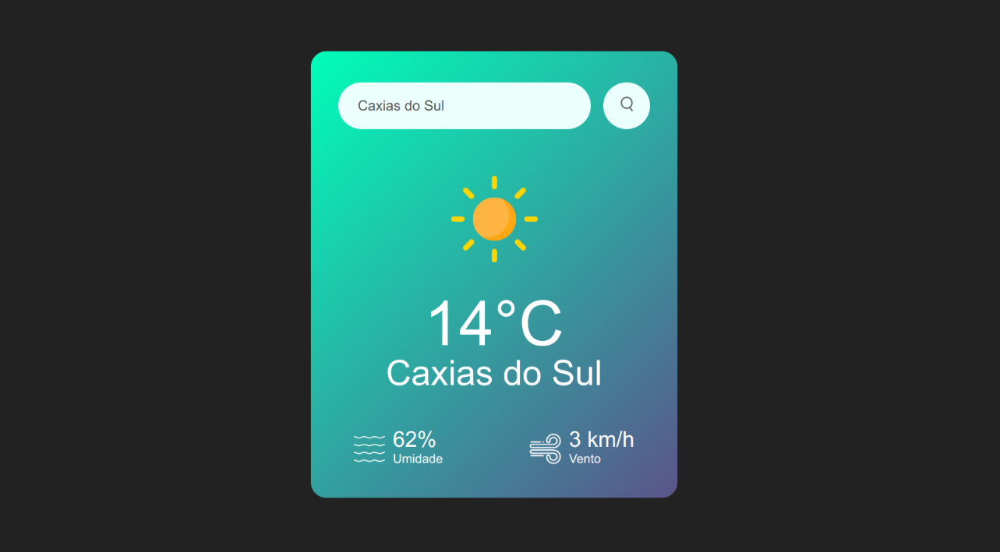

# ⛅ App de Clima

Um simples aplicativo de previsão do tempo feito com **HTML** , **CSS** e **JavaScript** , que utiliza a API do OpenWeatherMap para fornecer dados meteorológicos em tempo real com base no nome da cidade fornecida pelo usuário.

### 🛠️ Tecnologias Utilizadas

* HTML5
* CSS3
* JavaScript (Vanilla)
* [OpenWeatherMap API]()

### 🔍 Funcionalidades

* Busca de informações do tempo digitando o nome de qualquer cidade.
* Exibe:
  * Nome da cidade
  * Temperatura atual (°C)
  * Umidade do ar (%)
  * Velocidade do vento (km/h)
  * Ícone representando o clima atual (chuva, sol, nublado, etc.)
* Mensagem de erro para nomes de cidades inválidos.

### Preview:

